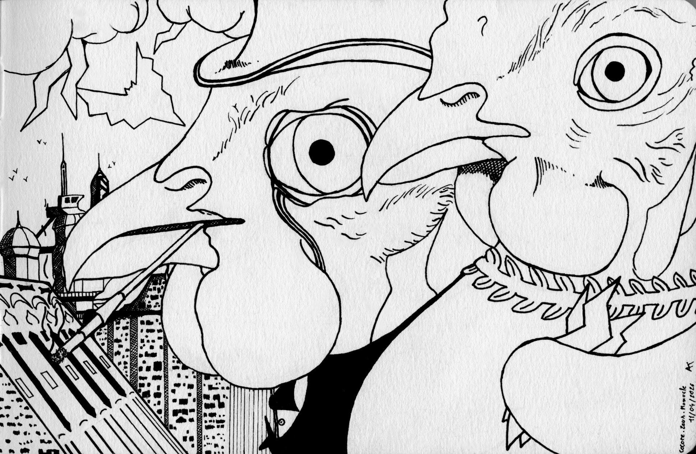

# ✏️ Dessin en trois mots: cocotte - zeus - monocle

J'ai toujours beaucoup de questions en tête, signe d'une activité cérébrale minimale vous me direz. Avons-nous besoin d'être compétent, bien que ce soit pour le plaisir ? Ne devrions-nous pas tous aspirer à l'affinement de nos capacités, bien que ces dernières soient sans prétention ? Mais en même temps, faire est le seul moyen de s'améliorer.

Mais pourquoi le montrer aux autres, pourquoi exposer sa médiocrité et plus étrange encore, pourquoi à certains moments, demander un avis. _Ce qui n'est pas le cas ici._

Serait-ce pour se rassurer de ne pas être si mauvais ? S'auto-encourager ? Une demande de commentaire doit du moins se baser sur un espoir, même vain, d'avoir un encouragement permettant de forger un regain d'amour-propre.

**Putain, c'est beau s'que j'dis !**
